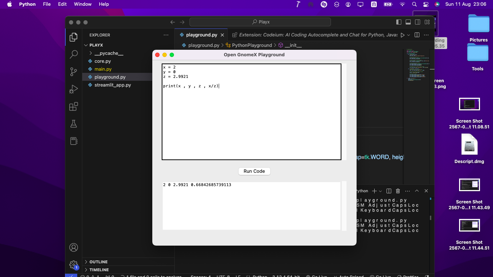
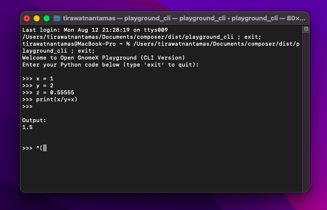

# OpenGNOMEX

**OpenGNOMEX** is an open-source project inspired by GNOME's modern design, offering a real-time Python playground with dynamic code execution.

## Project Components

- **`core.py`**: Manages and controls the playground, handling real-time code execution.
- **`playground.py`**: The front-facing script providing a sleek, interactive Python coding environment.

## Features

- **Instant Feedback**: Code runs and updates live as you type.
- **Sleek GNOME-Style UI**: Minimalistic, responsive interface for a seamless experience.
- **Easily Extensible**: Customize and add new tools effortlessly.

## Visuals

<div style="text-align:center">
  
  <p><em>Figure 1: OpenGNOMEX Playground</em></p>
</div>

<div style="text-align:center">
  
  <p><em>Figure 1: OpenGNOMEX Playground</em></p>
</div>

## Quick Start

Clone the repo and start coding instantly:

```bash
git clone https://github.com/XevilA/OpenGNOMEX.git
cd OpenGNOMEX
python playground.py
